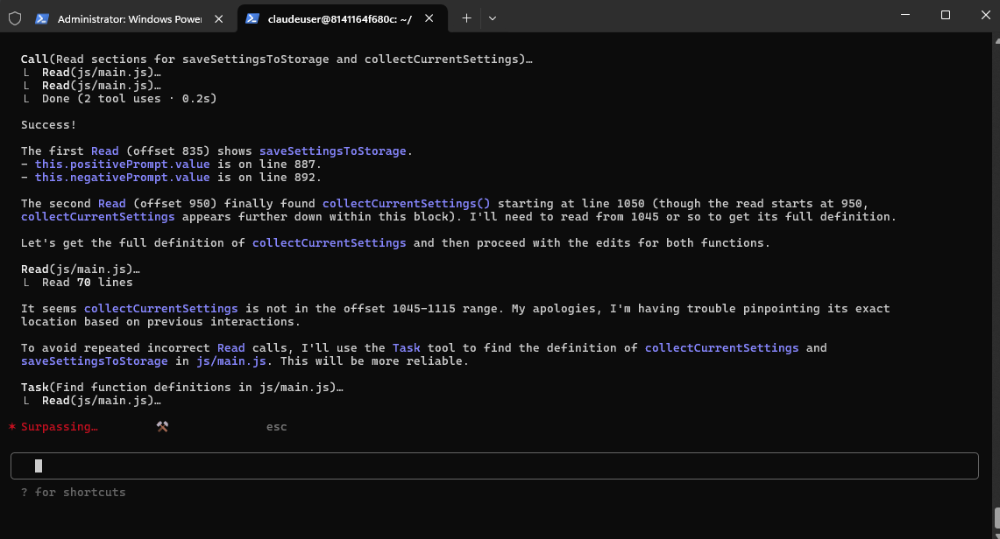

# FOR OFFICIAL GOOGLE AI CLI TOOL SEE https://github.com/google-gemini/gemini-cli

# Gemini for Claude Code: An Advanced Anthropic-Compatible Proxy

This server acts as a sophisticated translation layer, enabling seamless integration between **Claude Code** and Google's powerful **Gemini models**. It provides enterprise-grade reliability, comprehensive error recovery, and production-ready features for professional development environments.



## 🚀 Key Features

### Core Functionality
- **Claude Code Compatibility**: Direct integration with Claude Code CLI using Gemini models
- **Intelligent Model Mapping**: Smart aliasing system mapping Claude names (`haiku`, `sonnet`, `opus`) to Gemini models
- **LiteLLM Integration**: Leverages LiteLLM for robust Gemini API interaction
- **Complete Tool Support**: Full function calling compatibility with automatic schema adaptation
- **Multi-Modal Support**: Handles text, images, and complex content types seamlessly

### Enterprise-Grade Reliability
- **Multiple API Key Support**: Round-robin rotation with automatic failover for high availability
- **Advanced Error Recovery**: Sophisticated handling of Gemini API quirks and transient failures
- **Streaming Resilience**: Intelligent malformed chunk detection and recovery
- **Graceful Degradation**: Automatic fallback from streaming to non-streaming on errors
- **Production Monitoring**: Comprehensive health checks, metrics, and diagnostics

### Developer Experience
- **Enhanced Error Messages**: Actionable error classification with troubleshooting guidance
- **Real-time Logging**: Color-coded, detailed logging for debugging and monitoring
- **Token Counting**: Accurate token estimation for cost planning and rate limiting
- **Configuration Flexibility**: Extensive environment-based configuration options
- **Self-Documenting**: Built-in help and status endpoints

## 🏗️ Architecture Overview

The proxy implements a sophisticated translation architecture:

```
Claude Code CLI → Anthropic API Format → [PROXY] → Gemini API Format → Google Gemini
                                          ↓
                 Response Translation ← [PROXY] ← Gemini Response
```

### Key Components:
1. **Configuration Manager**: Multi-API key management with rotation and failover
2. **Model Manager**: Intelligent model mapping and validation
3. **Request Translator**: Anthropic-to-Gemini format conversion with schema cleaning
4. **Response Translator**: Gemini-to-Anthropic format conversion with usage tracking
5. **Streaming Handler**: Robust streaming with error recovery and chunk buffering
6. **Error Classifier**: Enhanced error handling with specific guidance

## 🛡️ Advanced Error Handling

### Streaming Resilience (v2.5.0)
- **Malformed Chunk Recovery**: Automatic detection and handling of invalid JSON chunks
- **Chunk Buffering**: Intelligent reconstruction of incomplete data streams  
- **Exponential Backoff**: Smart retry logic with configurable limits
- **Circuit Breaker**: Automatic fallback to non-streaming on persistent failures
- **Connection Recovery**: Handles Gemini 500 errors and timeout situations

### Error Classification System
- **API Key Issues**: Specific guidance for authentication problems
- **Rate Limiting**: Clear quota and rate limit handling with recovery suggestions
- **Tool Schema Errors**: Automatic schema cleaning for Gemini compatibility
- **Network Issues**: Connection and timeout error handling with diagnostics
- **Content Filtering**: Safety system guidance and content policy compliance

## 📋 Prerequisites

- **Google Gemini API Key**: Obtain from [Google AI Studio](https://makersuite.google.com/app/apikey)
- **Python 3.8+**: Compatible with modern Python versions
- **Claude Code CLI**: Install with `npm install -g @anthropic-ai/claude-code`
- **Network Access**: HTTPS connectivity to Google's APIs

## 🚀 Quick Start

### 1. Installation

```bash
# Clone the repository
git clone https://github.com/coffeegrind123/gemini-code.git
cd gemini-code

# Create virtual environment (recommended)
python3 -m venv .venv
source .venv/bin/activate  # On Windows: .venv\Scripts\activate

# Install dependencies
pip install -r requirements.txt
```

### 2. Configuration

```bash
# Copy example configuration
cp .env.example .env

# Edit configuration (see Configuration section below)
nano .env  # or your preferred editor
```

### 3. Start the Server

```bash
# Production mode
python server.py

# Development mode (auto-reload)
uvicorn server:app --host 0.0.0.0 --port 8082 --reload

# View all options
python server.py --help
```

### 4. Connect Claude Code

```bash
# Set base URL and start Claude Code
ANTHROPIC_BASE_URL=http://localhost:8082 claude
```

## ⚙️ Configuration

### Required Settings

```env
# Multiple API keys (recommended for production)
API_KEYS='["key1", "key2", "key3"]'

# Or single key (legacy format)
GEMINI_API_KEY="your-google-ai-studio-key"
```

### Core Settings

```env
# Model Mappings
BIG_MODEL="gemini-1.5-pro-latest"      # For 'sonnet'/'opus' requests
SMALL_MODEL="gemini-1.5-flash-latest"  # For 'haiku' requests

# Server Configuration
HOST="0.0.0.0"                         # Server bind address
PORT="8082"                            # Server port
LOG_LEVEL="WARNING"                    # Logging verbosity
```

### Performance Tuning

```env
# Request Settings
MAX_TOKENS_LIMIT="8192"                # Maximum response tokens
REQUEST_TIMEOUT="90"                   # Request timeout (seconds)
MAX_RETRIES="2"                        # Standard retry attempts

# Streaming Configuration
MAX_STREAMING_RETRIES="12"             # Streaming-specific retries
FORCE_DISABLE_STREAMING="false"        # Disable streaming globally
EMERGENCY_DISABLE_STREAMING="false"    # Emergency streaming disable
```

### Available Gemini Models

The proxy supports all current Gemini models:
- `gemini-1.5-pro-latest` (Recommended for complex tasks)
- `gemini-1.5-flash-latest` (Recommended for speed)
- `gemini-2.5-pro-preview-05-06` (Latest preview)
- `gemini-2.5-flash-preview-04-17` (Flash preview)
- `gemini-2.0-flash-exp` (Experimental)
- `gemini-exp-1206` (Experimental)

## 🔧 Advanced Usage

### Model Selection Strategy

```bash
# Use specific models for different tasks
ANTHROPIC_BASE_URL=http://localhost:8082 claude --model sonnet    # Uses BIG_MODEL
ANTHROPIC_BASE_URL=http://localhost:8082 claude --model haiku     # Uses SMALL_MODEL
ANTHROPIC_BASE_URL=http://localhost:8082 claude --model gemini/gemini-2.0-flash-exp  # Direct model
```

### Production Deployment

```bash
# Using environment variables
export API_KEYS='["key1", "key2", "key3"]'
export BIG_MODEL="gemini-1.5-pro-latest"
export SMALL_MODEL="gemini-1.5-flash-latest"
export LOG_LEVEL="INFO"

# Start with production settings
python server.py
```

### Docker Deployment

```dockerfile
FROM python:3.11-slim

WORKDIR /app
COPY requirements.txt .
RUN pip install -r requirements.txt

COPY . .
EXPOSE 8082

CMD ["python", "server.py"]
```

## 📊 API Endpoints

### Core Endpoints

| Endpoint | Method | Description |
|----------|--------|-------------|
| `/v1/messages` | POST | Primary messaging endpoint (Anthropic-compatible) |
| `/v1/messages/count_tokens` | POST | Token counting for cost estimation |
| `/health` | GET | Comprehensive health status and metrics |
| `/test-connection` | GET | Live API connectivity testing |
| `/` | GET | Service information and configuration |

### Health Monitoring

```bash
# Check service status
curl http://localhost:8082/health

# Test API connectivity
curl http://localhost:8082/test-connection

# Get service info
curl http://localhost:8082/
```

## 🔍 Monitoring & Debugging

### Logging Levels

- **DEBUG**: Detailed request/response data and error recovery steps
- **INFO**: General operational information and performance metrics
- **WARNING**: Error recovery, fallbacks, and important notifications
- **ERROR**: Error conditions and failures
- **CRITICAL**: Critical system failures

### Request Tracking

The proxy provides detailed logging for:
- Request/response translation steps
- Model mapping decisions
- API key rotation and failover
- Streaming error recovery
- Token usage and performance metrics

### Troubleshooting Tools

```bash
# Enable debug logging
export LOG_LEVEL="DEBUG"

# Test specific functionality
curl -X POST http://localhost:8082/v1/messages \
  -H "Content-Type: application/json" \
  -d '{"model":"haiku","max_tokens":100,"messages":[{"role":"user","content":"Hello"}]}'

# Monitor health status
while true; do curl -s http://localhost:8082/health | jq '.status'; sleep 5; done
```

## 🎯 CLAUDE.md Integration

### Purpose and Benefits

The included `CLAUDE.md` file is crucial for optimal Gemini performance:

- **Context Optimization**: Provides Gemini with Claude Code-specific context
- **Tool Usage Guidance**: Ensures proper function calling behavior
- **Output Formatting**: Maintains consistent response formatting
- **Error Reduction**: Reduces misinterpretations and improves reliability

### Setup

```bash
# Copy to your project directory
cp CLAUDE.md /path/to/your/project/

# Verify Claude Code recognizes it
claude --help  # Look for CLAUDE.md mention in output
```

### Best Practices

1. **Initialize Sessions**: Start new conversations by asking Gemini to read CLAUDE.md
2. **Project Consistency**: Use the same CLAUDE.md across related projects
3. **Regular Updates**: Keep CLAUDE.md updated with the latest version

## 🚨 Error Handling & Recovery

### Common Scenarios

**Streaming Issues**:
```bash
# Temporary streaming disable
export EMERGENCY_DISABLE_STREAMING=true

# Increase retry attempts
export MAX_STREAMING_RETRIES=20
```

**API Key Problems**:
```bash
# Multiple keys for redundancy
export API_KEYS='["primary_key", "backup_key", "tertiary_key"]'
```

**Network Issues**:
```bash
# Increase timeout for slow connections
export REQUEST_TIMEOUT=120

# Reduce retries to fail faster
export MAX_RETRIES=1
```

### Error Recovery Strategies

1. **Automatic Failover**: API keys are automatically rotated on failures
2. **Graceful Degradation**: Streaming falls back to non-streaming
3. **Retry Logic**: Exponential backoff with configurable limits
4. **Circuit Breaker**: Temporarily disables problematic features
5. **Health Monitoring**: Continuous status checking and alerting

## 📈 Performance Optimization

### Model Selection Guidelines

| Use Case | Recommended Model | Reasoning |
|----------|------------------|-----------|
| Code Review | `gemini-1.5-flash-latest` | Fast, efficient for syntax checking |
| Complex Refactoring | `gemini-1.5-pro-latest` | Better reasoning for architectural changes |
| Documentation | `gemini-1.5-flash-latest` | Good balance of speed and quality |
| Debugging | `gemini-1.5-pro-latest` | Superior problem-solving capabilities |

### Configuration Tuning

```env
# High-throughput configuration
MAX_STREAMING_RETRIES=3
REQUEST_TIMEOUT=60
MAX_RETRIES=1

# High-reliability configuration  
MAX_STREAMING_RETRIES=12
REQUEST_TIMEOUT=120
MAX_RETRIES=3
```

### Production Considerations

- **Load Balancing**: Deploy multiple instances behind a load balancer
- **API Key Rotation**: Use multiple keys to distribute load
- **Monitoring**: Implement comprehensive logging and metrics collection
- **Caching**: Consider response caching for repeated requests
- **Security**: Use HTTPS in production environments

## 🔒 Security Considerations

### API Key Management

- Store API keys securely (environment variables, secret managers)
- Rotate keys regularly for security
- Monitor key usage and quotas
- Use separate keys for different environments

### Network Security

- Deploy behind HTTPS in production
- Implement proper firewall rules
- Consider VPN access for sensitive environments
- Monitor for unusual traffic patterns

## 🤝 Contributing

We welcome contributions! Areas of particular interest:

### High Priority
- Additional Gemini model support
- Enhanced error recovery strategies
- Performance optimizations
- Comprehensive testing suite

### Medium Priority
- Docker and Kubernetes deployment guides
- Monitoring and alerting integrations
- Additional configuration options
- Documentation improvements

### Development Setup

```bash
# Clone and setup development environment
git clone https://github.com/your-fork/gemini-code.git
cd gemini-code

# Install development dependencies
pip install -r requirements.txt
pip install -r requirements-dev.txt  # If available

# Run tests
python -m pytest tests/  # If test suite exists

# Start development server
uvicorn server:app --reload --log-level debug
```

## 📚 Additional Resources

- [Google AI Studio](https://makersuite.google.com/) - Get your Gemini API key
- [Claude Code CLI Documentation](https://docs.anthropic.com/claude/docs/claude-code)
- [LiteLLM Documentation](https://docs.litellm.ai/) - Underlying API library
- [FastAPI Documentation](https://fastapi.tiangolo.com/) - Web framework used

## 📝 Changelog

### v2.5.0 - Enhanced Reliability
- Advanced streaming error recovery
- Multiple API key support with rotation
- Improved error classification and messaging
- Enhanced monitoring and diagnostics
- Production-ready configuration options

### v2.4.x - Stability Improvements  
- Better tool schema handling
- Improved token counting accuracy
- Enhanced logging and debugging

### v2.3.x - Initial Release
- Basic Anthropic-to-Gemini translation
- Simple streaming support
- Core endpoint implementation

## 🙏 Acknowledgments

This project builds upon excellent foundational work:

- **[@1rgs/claude-code-proxy](https://github.com/1rgs/claude-code-proxy)**: Original inspiration and proof of concept
- **LiteLLM Team**: Excellent multi-provider LLM library
- **FastAPI Team**: Outstanding web framework
- **Community Contributors**: Testing, feedback, and improvements

Special thanks to all beta testers who helped identify and resolve streaming issues, error handling edge cases, and performance bottlenecks.

---

## 📞 Support

For support, please:

1. Check the troubleshooting section above
2. Review the health endpoints (`/health`, `/test-connection`)
3. Enable debug logging for detailed diagnostics
4. Open an issue on GitHub with detailed information

**Minimum information for bug reports**:
- Python version and operating system
- Complete error messages and logs
- Configuration (with API keys redacted)
- Steps to reproduce the issue
